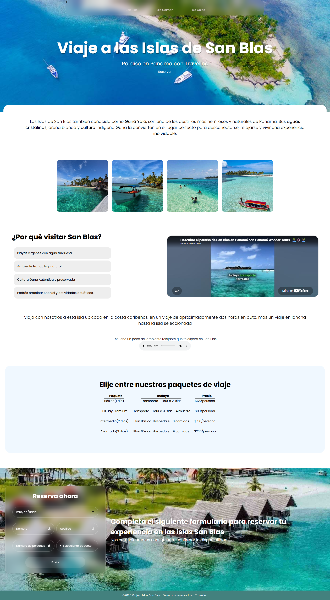

# Web Turística San Blas

## Descripción del proyecto

Este proyecto consiste en una página web turística sobre las Islas de San Blas, también conocidas como Guna Yala, en Panamá.

La página fue creada originalmente el año pasado como un proyecto realizado en grupo. En esta ocasión retomamos el proyecto para realizar diferentes modificaciones y mejoras solicitadas por el profesor, relacionadas con la organización, optimización y documentación del código.

La página presenta información sobre el destino mediante imágenes, videos, audio, paquetes de viaje y un formulario de reserva.

## Objetivo

El objetivo de este proyecto es mejorar una página web que ya había sido desarrollada anteriormente, aplicando cambios que permitan tener un código más organizado, fácil de entender y sencillo de mantener.

También se busca documentar los cambios realizados y utilizar Git y GitHub para llevar un registro de las diferentes versiones del proyecto.

## Visualización del proyecto


## Contenido de la página

La página está dividida en diferentes secciones:

* Portada con una imagen principal y una opción para reservar.
* Información introductoria sobre San Blas.
* Galería de imágenes relacionadas con el destino.
* Información sobre las razones para visitar las islas.
* Video relacionado con San Blas.
* Audio con sonidos ambientales.
* Tabla con diferentes paquetes de viaje.
* Formulario para realizar una solicitud de reserva.
* Pie de página con la información del proyecto.

## Tecnologías utilizadas

Para realizar el proyecto utilizamos:

* HTML5 para crear la estructura de la página.
* CSS3 para el diseño y los estilos.
* Google Fonts para utilizar la tipografía Poppins.
* Boxicons para los iconos utilizados en el formulario.
* YouTube para los videos relacionados con el destino.

## Estructura del proyecto

La estructura básica del proyecto es la siguiente:

```text
WEB-TURISTICA/
│
├── index.html
├── style.css
├── README.md
├── ocean-waves-250310.mp3
│
└── imagenes/
    ├── San-blas.jpg
    ├── aguas-cristalinas.jpg
    ├── transporte-a-la-isla.jpg
    ├── paraiso.jpg
    ├── visualización-del-proyecto.png
    └── playas.jpg
    
```

## Características

Entre las principales características de la página se encuentran:

* Diseño enfocado en un destino turístico.
* Uso de imágenes para mostrar el lugar.
* Enlaces a videos relacionados con San Blas.
* Reproducción de audio.
* Tabla para presentar los paquetes de viaje.
* Formulario para recopilar los datos de una reserva.
* Uso de diferentes elementos HTML para organizar el contenido.
* Estilos personalizados mediante CSS.

## Cambios y mejoras realizados

Para este trabajo retomamos el proyecto original y realizamos diferentes modificaciones para mejorar el código.

Entre los cambios realizados se encuentran:

* Mejora de los nombres de algunas clases para que sea más fácil identificar su función.
* Corrección de errores encontrados en HTML y CSS.
* Eliminación de código CSS repetido cuando era posible.
* Organización de algunos estilos para facilitar su mantenimiento.
* Mejora de los comentarios dentro del código.
* Incorporación de textos alternativos en las imágenes.
* Cambio de la selección de paquetes para permitir elegir solamente un paquete.
* Mejora de la documentación mediante este archivo README.

Los cambios se realizaron manteniendo la idea y el diseño principal de la página original.

## Control de versiones

Para llevar un registro de las modificaciones utilizamos Git y GitHub.

Primero se conservó la versión original del proyecto y posteriormente se agregó la versión modificada.

## Estado del proyecto

La página funciona actualmente como un proyecto académico y está diseñada principalmente para visualizarse desde una computadora.

El proyecto original no contaba con una adaptación completa para dispositivos móviles, por lo que este aspecto puede ser considerado como una mejora para futuras versiones.

## Aprendizaje

Al trabajar nuevamente con este proyecto pudimos observar algunos aspectos del código que podían mejorarse desde que fue creado originalmente.

Esta actividad nos permitió practicar la refactorización del código, mejorar la organización de HTML y CSS, agregar documentación y utilizar Git y GitHub para controlar las diferentes versiones del proyecto.

También nos ayudó a entender que un proyecto no termina cuando la página funciona, sino que es importante mantener el código organizado y documentado para que pueda modificarse con mayor facilidad posteriormente.

## Autores

Proyecto realizado originalmente por:

* Grace Solís
* Maria Caballero
* Clara Palacio

Proyecto retomado y actualizado para el Taller Práctico #1 de Entornos de Programación.

